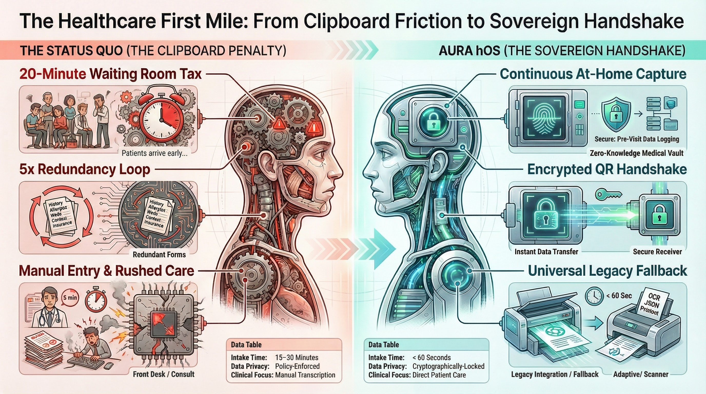
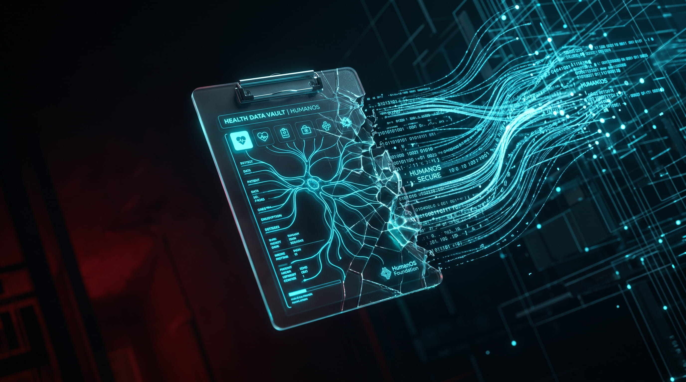
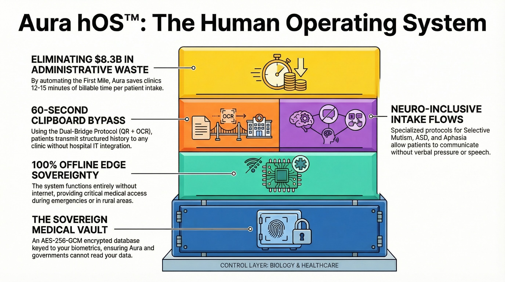
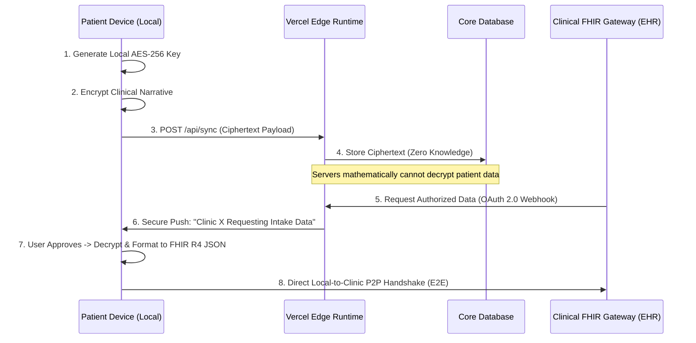

<div align="center">

# Humanos Foundation
### The Advocacy Kernel & Human Operations Layer

[](https://opensource.org/licenses/MIT)
[](https://nodejs.org)
[](https://vitejs.dev)
[](https://reactjs.org)

**[Visit the Foundation](https://humanos.foundation)** • **[Read the Manifesto](https://humanos.foundation/manifesto)** • **[Join the Revolution](https://humanos.foundation/join)**

---

*"We are engineering the 256-bit AES-GCM local-first data vault to cryptographically secure your clinical narrative."*

</div>


## 🌍 The Mission

The **Humanos Foundation** is the 501(c)(3) Sovereign advocacy wing of the **Aura hOS™ (Human Operating System)**. We are a global network of patients, clinicians, and technologists dedicated to dismantling the 15-20 page clinical clipboard penalty. 

### 🏛️ The Foundation Vanguard
Our movement replaces the hostile "assembly-line" medical intake process with a cryptographic Digital Handshake, permanently securing patient data autonomy.

<p align="center">
  
  
</p>
<p align="center">
  
  
</p>

This repository powers our digital advocacy platform, designed to manage donor pathways, parse localized Markdown for our sovereign education library, and facilitate Federated Clinic Lead Generation via the FHIR R4 schema.

---

## 🏗️ Architectural Boundaries

To protect our regulatory standing, the ecosystem is strictly divided into two distinct perimeters:

### 1. The Human Operations Layer (This Repository)
Powers `humanos.foundation`. This is the administrative surface area of the NGO.
- **Frontend:** React 18 SPA, deployed via Vercel Edge.
- **Backend (CRM):** Bound directly to Odoo (`teams.humanos.foundation`) via internal iframes and XML-RPC webhook payloads.
- **Use Case:** Recruiting, Helpdesk, GoFundMe routing, and Federal Grant validation.
- **Design System:** Custom CSS, Tailwind, and Framer Motion decorative animations (No diagnostic logic).

### 2. The Machine Layer (External Repository)
Powers `aurahos.io` and the Clinical Patient Vault. For engineering the core software, please see the `aura-health-os` repository.
- **Frontend:** Capacitor / React Native.
- **Backend:** Local-First IndexedDB and PostgREST via Edge Functions.
- **Use Case:** The Federated Clinic Route, FHIR R4 JSON Payload Generation, and AES-GCM encrypted vaults.

### 3. Cryptographic Data Flow (Zero-Knowledge Sync)



---

## 🚀 Presentation & Quick Start

### 1. Prerequisites
- **Node.js**: v20 or higher
- **Git**

### 2. Deployment
```bash
git clone https://github.com/RamonRiosJr/humanos.foundation.git
cd humanos.foundation
npm install
```

### 3. Launching the Advocacy Kernel
Executes the UI sequence and launches the local Vite development server (Note: executes zero local cryptographic operations).

```bash
npm run dev
```

> **Access Portal**: [http://localhost:7200](http://localhost:7200)

---

## 🔒 Security & FTC HBNR BAA Exemption

We believe Privacy is a request, but Sovereignty is mathematics. 

By utilizing **256-bit AES-GCM Encryption with Web Crypto API key isolation** on the Machine Layer, Aura hOS operates distinctly under the **FTC Health Breach Notification Rule (HBNR)** as a Personal Health Record. Although this repository strictly handles Human Operations, we enforce the same Zero-Trust standard:

- **Ethical Integrity:** Contact and Waitlist nodes route strictly through authenticated Odoo CRM endpoints using webhook payload encryption. We do not sell analytics.
- **Zero Third-Party Trackers**: We have purged all unauthorized Google/Meta marketing tracking scopes. 
- **Privacy Handshake**: Optional telemetry (PostHog) is loaded dynamically and strictly respects Edge rendering constraints without accessing persistent local state.

For more information on how we bypass FDA SaMD and HIPAA BAA traps, please see our [Zero-Knowledge Whitepaper](/whitepaper).

---

## 🤝 The Contributor's Path

We are scaling an sovereign-grade contributor network:

- **Data Scientists/Engineers**: Help us harden the local encryption logic or optimize the UI compiling speeds locally.
- **Clinicians**: Validate our UX logic against "Root-Cause" workflows.
- **Advocates**: Help us scale the 501(c)(3) pipeline by driving awareness.

1. Review the [Code of Conduct](CODE_OF_CONDUCT.md).
2. Read the [Contributor Guidelines](CONTRIBUTING.md).
3. Check the [Project Board](https://github.com/RamonRiosJr/humanos.foundation/projects) for active validation tasks.

---

<div align="center">

**Built by patients, for patients.** 
*Data Sovereignty is a Human Right.*

[**Developed by Ramon Luis Rios Jr @ Coqui Cloud Dev Co.**](https://coqui.cloud)

</div>
